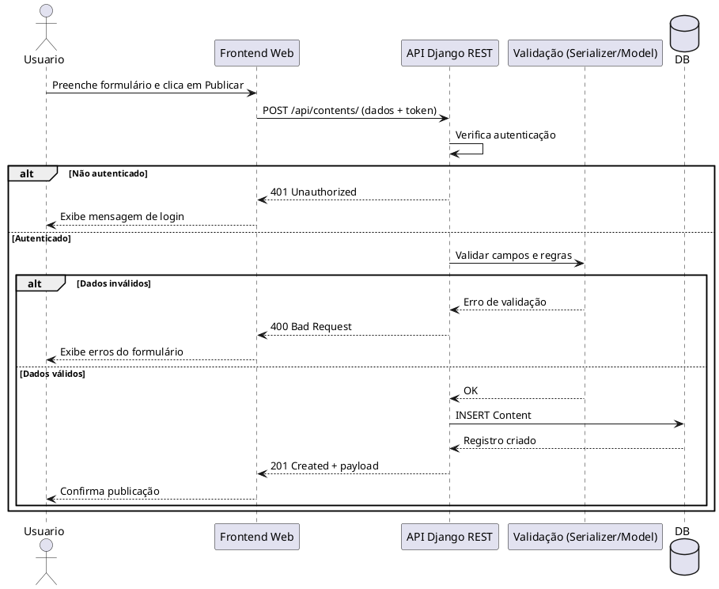

# 16 - Diagrama de Sequência (Básico)

## Objetivo

Construir um diagrama de sequência para representar, de forma simples, a interação entre cliente, API e banco de dados no app Streaming.

## Cenário sugerido

Use o caso principal: **usuário autenticado publica um conteúdo**.

## Participantes

- Ator: Usuário
- Fronteira: Frontend Web
- Controle: API Django REST (`ContentViewSet`)
- Entidade: Modelo `Content`
- Persistência: Banco de Dados (SQLite/PostgreSQL)

## Passo a passo

1. Defina o início do fluxo no ator (Usuário clica em "Publicar").
2. Mostre a chamada HTTP do Frontend para a API (`POST /api/contents/`).
3. Represente a validação de autenticação (token/sessão).
4. Represente a validação de regras de negócio:
   - `description` obrigatória
   - `thumbnail_url` obrigatória
   - `title` único por criador
5. Mostre a persistência no banco (`INSERT` na tabela de conteúdos).
6. Finalize com o retorno da API:
   - Sucesso: `201 Created`
   - Falha: `400 Bad Request` ou `401 Unauthorized`

## Exemplo básico em PlantUML

## Entregável mínimo

- 1 diagrama de sequência contendo:
  - ator, frontend, API, validação e banco
  - fluxo principal de sucesso
  - ao menos 1 fluxo alternativo de erro

## Critérios de avaliação sugeridos

- Correção da ordem das mensagens
- Presença de validações e autenticação
- Clareza na separação entre sucesso e erro
- Consistência com endpoints já implementados no projeto

## Extensão opcional

Após concluir o fluxo de publicação, modele também:

- Consumo de conteúdo (`GET /api/contents/`)
- Criação de playlist com associação N:N
- Filtro de conteúdos por tipo (`audio`/`video`)
