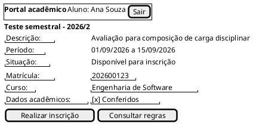
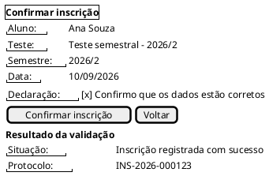
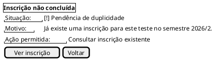
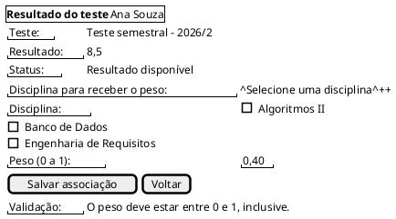
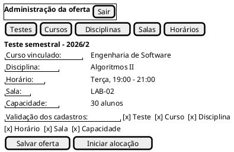
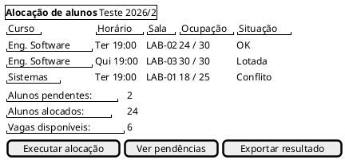
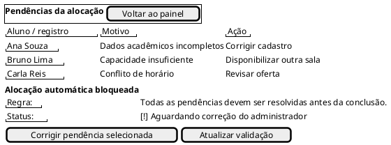

# Protótipos de Baixa Fidelidade

Os protótipos abaixo representam o fluxo de inscrição, avaliação, associação de peso e alocação definido no [cenário operacional](../../diagramas/cenario.md). Eles priorizam o conteúdo e as regras de negócio, sem definir cores, identidade visual ou detalhes finais de interação.

## Fluxo do aluno

### 1. Início e inscrição no teste

A tela permite ao aluno consultar o teste do semestre e iniciar uma única inscrição.

### 2. Confirmação e impedimento de duplicidade

A confirmação mostra os dados que serão gravados. A mesma área também comunica a pendência quando já existe inscrição para o teste e semestre.

### 3. Resultado e associação do peso

Depois da divulgação do resultado, o aluno escolhe uma disciplina e informa um peso no intervalo de 0 a 1.

## Fluxo do administrador

### 4. Cadastro da oferta e validação dos dados

O administrador mantém os dados necessários antes de iniciar a alocação.

### 5. Alocação por curso, horário e capacidade

O painel evidencia a capacidade utilizada e só permite concluir quando não há conflitos nem falta de vagas.

### 6. Pendências que impedem a conclusão

Toda inconsistência fica registrada com motivo e ação necessária para o administrador.

## Regras representadas

- Uma inscrição por aluno, teste e semestre.
- Dados acadêmicos obrigatórios e previamente cadastrados.
- Peso numérico entre 0 e 1, inclusive, associado a uma disciplina.
- Alocação condicionada à existência de curso, horário, sala e capacidade.
- Duplicidade, dados inválidos, conflito de horário e falta de vagas geram pendências e bloqueiam a conclusão automática.

## Fonte editável

O código completo das telas está disponível em [prototipos_baixa_fidelidade.puml](../../diagramas/prototipos_baixa_fidelidade.puml).
